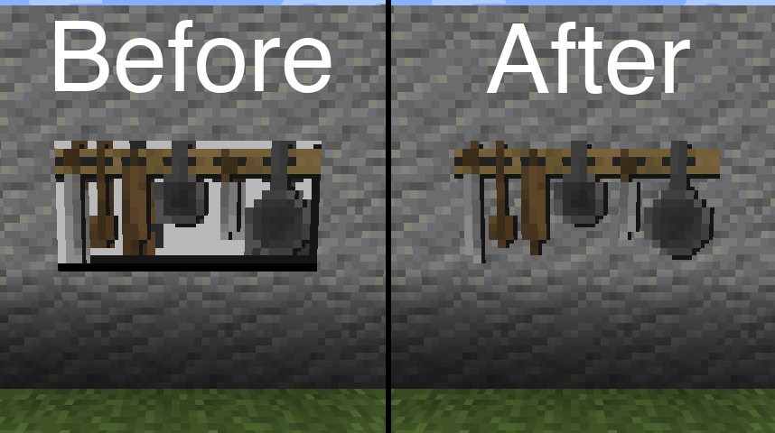

# Transparent

[](https://www.curseforge.com/minecraft/mc-mods/transparent)
[](https://www.curseforge.com/minecraft/mc-mods/transparent)


Allows resource packs to make entities support transparency.



Resource pack in above image: [BwW Texturepack](https://www.curseforge.com/minecraft/texture-packs/bww-texturepack)

## Supported Entities:

Entities with a '*' are disabled by default.

- Painting
- Item Frame
- Beacon Beam*

Want an entity added to that list? Contact me on discord and let me know why you want it: https://discord.gg/aqXkvbJ

## Config

Configuration is done through resource packs.

If you only want the defaults, you don't need a configuration file.

Note: Defaults may change in future updates if

| Entity      | Enabled By Default | Reason |
| ----------- | ------------------ | ------ |
| Painting    | true               |
| Item Frame  | true               |
| Beacon Beam | false              | Enabling transparency causes render layer bugs. |

### Default configuration file

Place in your resource pack in `/assets/transparent/transparent.json`.

```json
{
    "painting": true,
    "item_frame": true,
    "beacon_beam": false
}
```

## License

All assets found in the following directories are licensed under All Rights Reserved.
- ./common/src/main/resources/assets/
- ./fabric/src/main/resources/assets/
- ./forge/src/main/resources/assets/
- ./quilt/src/main/resources/assets/

Everything else is licensed under MIT.

Want clarification or explicit permission? Contact me on [Discord](https://discord.gg/aqXkvbJ).

## Other Information

- Report issues here: https://github.com/Trikzon/transparent/issues
- Join my discord: https://discord.gg/aqXkvbJ
- You can include this mod in your modpack as long as you don't claim the mod as your own.

[](https://ko-fi.com/trikzon)
